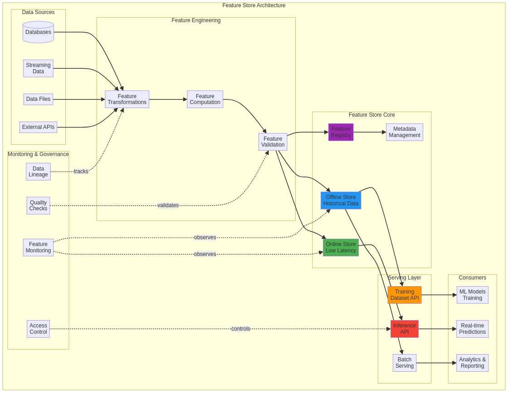

# Feature Store Architecture


Este projeto pode ser visualizado e interagido através do GitHub Pages: [https://gabrieldemetrioslafis.github.io/feature-store-architecture/](https://gabrieldemetrioslafis.github.io/feature-store-architecture/)

This project can be viewed and interacted with via GitHub Pages: [https://gabrieldemetrioslafis.github.io/feature-store-architecture/](https://gabrieldemetrioslafis.github.io/feature-store-architecture/)

---

## 🇧🇷 Arquitetura de Feature Store

Este repositório explora e demonstra **arquiteturas e implementações de Feature Stores**, componentes cruciais para a operacionalização de modelos de Machine Learning (ML). O foco é em como projetar, construir e gerenciar um Feature Store que suporte o ciclo de vida completo do ML, desde o desenvolvimento até a implantação e monitoramento, garantindo **consistência, reusabilidade e baixa latência** para features em ambientes de treinamento e inferência.

### 🎯 Objetivo

O principal objetivo deste projeto é **fornecer um guia prático e exemplos de código** para engenheiros de ML, cientistas de dados e arquitetos que desejam implementar ou otimizar um Feature Store. Serão abordados os conceitos fundamentais, padrões de design, tecnologias comuns e as melhores práticas para garantir um fluxo de trabalho de ML eficiente e robusto.

### ✨ Destaques

- **Consistência de Features**: Estratégias para garantir que as features usadas no treinamento sejam idênticas às usadas na inferência, eliminando o *skew* de treinamento/serviço.
- **Reusabilidade e Descoberta**: Como organizar e catalogar features para que possam ser facilmente descobertas e reutilizadas por diferentes equipes e modelos.
- **Baixa Latência**: Implementações otimizadas para servir features em tempo real para inferência online, além de processamento em lote para treinamento.
- **Código Profissional**: Exemplos de código bem estruturados, seguindo as melhores práticas da indústria, com foco em modularidade, escalabilidade e manutenibilidade.
- **Documentação Completa**: Cada aspecto da arquitetura é acompanhado de documentação detalhada, diagramas explicativos e casos de uso práticos.
- **Testes Incluídos**: Módulos de código validados através de testes unitários e de integração, garantindo a robustez e a confiabilidade das soluções.
- **Abordagem Didática**: Conteúdo apresentado de forma didática, ideal para aprendizado e referência, com explicações claras sobre os conceitos e a aplicação prática.


## 🇬🇧 Feature Store Architecture

This repository explores and demonstrates **Feature Store architectures and implementations**, crucial components for operationalizing Machine Learning (ML) models. The focus is on how to design, build, and manage a Feature Store that supports the entire ML lifecycle, from development to deployment and monitoring, ensuring **consistency, reusability, and low latency** for features in training and inference environments.

### 🎯 Objective

The main objective of this project is to **provide a practical guide and code examples** for ML engineers, data scientists, and architects who want to implement or optimize a Feature Store. It will cover fundamental concepts, design patterns, common technologies, and best practices to ensure an efficient and robust ML workflow.

### ✨ Highlights

- **Feature Consistency**: Strategies to ensure that features used in training are identical to those used in inference, eliminating training/serving skew.
- **Reusability and Discoverability**: How to organize and catalog features so they can be easily discovered and reused by different teams and models.
- **Low Latency**: Optimized implementations for serving features in real-time for online inference, as well as batch processing for training.
- **Professional Code**: Well-structured code examples, following industry best practices, with a focus on modularity, scalability, and maintainability.
- **Complete Documentation**: Every aspect of the architecture is accompanied by detailed documentation, explanatory diagrams, and practical use cases.
- **Tests Included**: Code modules validated through unit and integration tests, ensuring the robustness and reliability of the solutions.
- **Didactic Approach**: Content presented didactically, ideal for learning and reference, with clear explanations of concepts and practical application.

### 📊 Visualization



*Illustrative diagram of a Feature Store architecture, highlighting key components and data flow.*

---

## 📁 Repository Structure

```
feature-store-architecture/
├── src/           # Código fonte e exemplos de implementação de Feature Store
├── data/          # Dados de exemplo e datasets para simulação
├── images/        # Imagens e diagramas para o README e documentação
├── tests/         # Testes unitários e de integração para os componentes do Feature Store
├── docs/          # Documentação adicional, guias e whitepapers sobre Feature Stores
└── scripts/       # Scripts utilitários para automação, deploy e gerenciamento
```

---

## 🚀 Getting Started

Para começar, clone o repositório e explore os diretórios `src/` e `docs/` para exemplos detalhados e instruções de uso. Certifique-se de ter as dependências necessárias instaladas (Python, Docker, Kubernetes, etc.).

```bash
git clone https://github.com/GabrielDemetriosLafis/feature-store-architecture.git
cd feature-store-architecture
# Siga as instruções específicas em src/ e docs/
```

---

## 🤝 Contribuição

Contribuições são bem-vindas! Sinta-se à vontade para abrir issues, enviar pull requests ou sugerir melhorias. Por favor, siga as diretrizes de contribuição.

---

## 📝 Licença

Este projeto está licenciado sob a Licença MIT - veja o arquivo [LICENSE](LICENSE) para detalhes.

---

**Autor:** Gabriel Demetrios Lafis  
**Ano:** 2025

