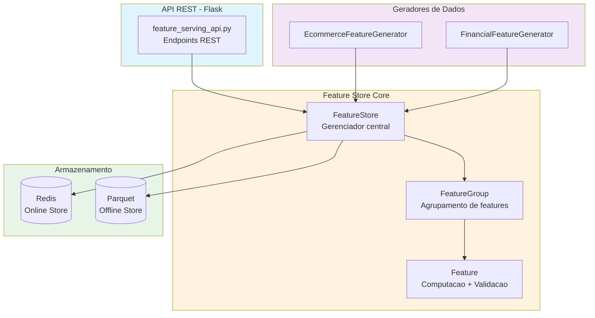

# Feature Store Architecture

[](https://www.python.org/)
[](https://flask.palletsprojects.com/)
[](https://redis.io/)
[](LICENSE)
[](Dockerfile)

[English](#english) | [Portugues](#portugues)

---

## Portugues

### Visao Geral

Feature Store para pipelines de Machine Learning. Gerencia a computacao, armazenamento e servimento de features com armazenamento online (Redis) para inferencia de baixa latencia e armazenamento offline (Parquet) para treinamento de modelos. Inclui API REST (Flask) e geradores de dados de exemplo para e-commerce e financas.

### Arquitetura


```mermaid
graph TB
    subgraph API["API REST - Flask"]
        SERVE[feature_serving_api.py<br/>Endpoints REST]
    end

    subgraph Core["Feature Store Core"]
        FS[FeatureStore<br/>Gerenciador central]
        FG[FeatureGroup<br/>Agrupamento de features]
        FT[Feature<br/>Computacao + Validacao]
    end

    subgraph Storage["Armazenamento"]
        REDIS[(Redis<br/>Online Store)]
        PARQUET[(Parquet<br/>Offline Store)]
    end

    subgraph Examples["Geradores de Dados"]
        ECOM[EcommerceFeatureGenerator]
        FIN[FinancialFeatureGenerator]
    end

    SERVE --> FS
    FS --> FG
    FG --> FT
    FS --> REDIS
    FS --> PARQUET
    ECOM --> FS
    FIN --> FS

    style API fill:#e1f5fe
    style Core fill:#fff3e0
    style Storage fill:#e8f5e9
    style Examples fill:#f3e5f5
```

### Funcionalidades

- **Armazenamento Online**: Redis para servir features com baixa latencia em inferencia
- **Armazenamento Offline**: Parquet particionado por data para treinamento de modelos
- **API REST**: Endpoints Flask para ingestao, consulta e listagem de features e grupos
- **Computacao de Features**: Pipeline de transformacao com funcoes customizaveis e validacao
- **Metadados**: Controle de tipo, status (draft/active/deprecated/archived), versao e owner
- **Geradores de Exemplo**: Dados sinteticos de e-commerce (clientes, produtos, interacoes) e financas (transacoes com fraud score)

### Estrutura do Projeto

```
feature-store-architecture/
├── src/
│   ├── __init__.py
│   ├── feature_store.py          # Core: FeatureStore, Feature, FeatureGroup, dataclasses
│   ├── feature_serving_api.py    # API REST Flask
│   └── real_world_examples.py    # Geradores de dados (e-commerce, financas)
├── tests/
│   ├── test_feature_store.py     # Testes unitarios do core
│   ├── test_api.py               # Testes da API REST
│   ├── test_integration.py       # Testes de integracao
│   └── test_real_world_examples.py
├── examples/
│   ├── basic_usage.py            # Exemplo basico
│   ├── advanced_transformations.py
│   └── api_usage.py              # Exemplo de uso da API
├── diagrams/                     # Diagramas Mermaid (.mmd)
├── requirements.txt
├── LICENSE
└── README.md
```

### Como Executar

```bash
# Clonar o repositorio
git clone https://github.com/galafis/feature-store-architecture.git
cd feature-store-architecture

# Criar ambiente virtual
python -m venv venv
source venv/bin/activate  # Windows: venv\Scripts\activate

# Instalar dependencias
pip install -r requirements.txt

# Executar exemplo basico (gera dados sinteticos, nao precisa de Redis)
python -m src.feature_store

# Executar geradores de dados de exemplo
python -m src.real_world_examples

# Iniciar API REST (requer Redis rodando)
python -m src.feature_serving_api
```

### Testes

```bash
python -m pytest tests/ -v
```

### Tecnologias

| Tecnologia | Uso |
|------------|-----|
| Python | Linguagem principal |
| Redis | Armazenamento online (key-value) |
| PyArrow / Parquet | Armazenamento offline particionado |
| Flask | API REST |
| pandas / NumPy | Processamento de dados |

---

## English

### Overview

Feature Store for Machine Learning pipelines. Manages feature computation, storage and serving with an online store (Redis) for low-latency inference and an offline store (Parquet) for model training. Includes a Flask REST API and example data generators for e-commerce and finance use cases.

### Architecture


```mermaid
graph TB
    subgraph API["REST API - Flask"]
        SERVE[feature_serving_api.py<br/>REST Endpoints]
    end

    subgraph Core["Feature Store Core"]
        FS[FeatureStore<br/>Central manager]
        FG[FeatureGroup<br/>Feature grouping]
        FT[Feature<br/>Computation + Validation]
    end

    subgraph Storage["Storage"]
        REDIS[(Redis<br/>Online Store)]
        PARQUET[(Parquet<br/>Offline Store)]
    end

    subgraph Examples["Data Generators"]
        ECOM[EcommerceFeatureGenerator]
        FIN[FinancialFeatureGenerator]
    end

    SERVE --> FS
    FS --> FG
    FG --> FT
    FS --> REDIS
    FS --> PARQUET
    ECOM --> FS
    FIN --> FS

    style API fill:#e1f5fe
    style Core fill:#fff3e0
    style Storage fill:#e8f5e9
    style Examples fill:#f3e5f5
```

### Features

- **Online Store**: Redis for low-latency feature serving during inference
- **Offline Store**: Date-partitioned Parquet files for model training
- **REST API**: Flask endpoints for feature ingestion, retrieval and listing
- **Feature Computation**: Transformation pipeline with custom functions and validation rules
- **Metadata**: Type control, status lifecycle (draft/active/deprecated/archived), versioning and ownership
- **Example Generators**: Synthetic data for e-commerce (customers, products, interactions) and finance (transactions with fraud scores)

### Project Structure

```
feature-store-architecture/
├── src/
│   ├── __init__.py
│   ├── feature_store.py          # Core: FeatureStore, Feature, FeatureGroup, dataclasses
│   ├── feature_serving_api.py    # Flask REST API
│   └── real_world_examples.py    # Data generators (e-commerce, finance)
├── tests/
│   ├── test_feature_store.py     # Core unit tests
│   ├── test_api.py               # REST API tests
│   ├── test_integration.py       # Integration tests
│   └── test_real_world_examples.py
├── examples/
│   ├── basic_usage.py            # Basic usage example
│   ├── advanced_transformations.py
│   └── api_usage.py              # API usage example
├── diagrams/                     # Mermaid diagrams (.mmd)
├── requirements.txt
├── LICENSE
└── README.md
```

### How to Run

```bash
# Clone the repository
git clone https://github.com/galafis/feature-store-architecture.git
cd feature-store-architecture

# Create virtual environment
python -m venv venv
source venv/bin/activate  # Windows: venv\Scripts\activate

# Install dependencies
pip install -r requirements.txt

# Run basic example (generates synthetic data, no Redis needed)
python -m src.feature_store

# Run example data generators
python -m src.real_world_examples

# Start REST API (requires Redis running)
python -m src.feature_serving_api
```

### Tests

```bash
python -m pytest tests/ -v
```

### Technologies

| Technology | Usage |
|------------|-------|
| Python | Primary language |
| Redis | Online store (key-value) |
| PyArrow / Parquet | Partitioned offline store |
| Flask | REST API |
| pandas / NumPy | Data processing |

---

### Autor / Author

**Gabriel Demetrios Lafis**
- GitHub: [@galafis](https://github.com/galafis)
- LinkedIn: [Gabriel Demetrios Lafis](https://linkedin.com/in/gabriel-demetrios-lafis)

### Licenca / License

MIT License - veja [LICENSE](LICENSE) para detalhes / see [LICENSE](LICENSE) for details.
