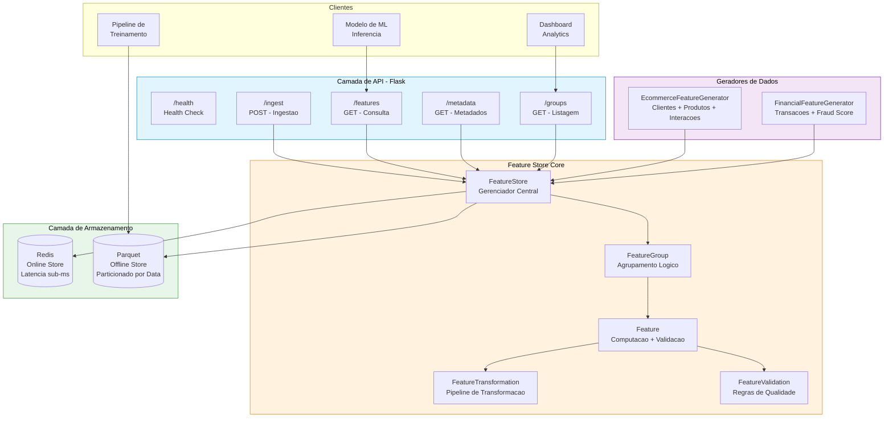
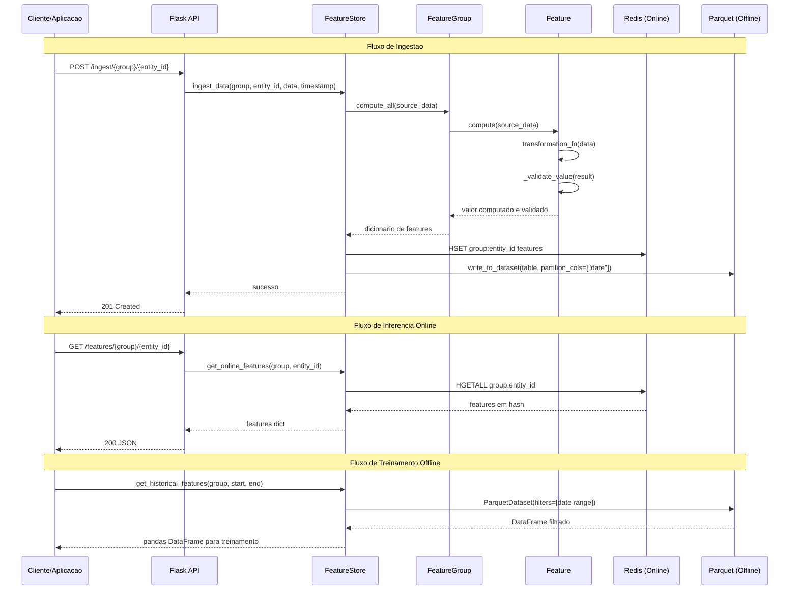
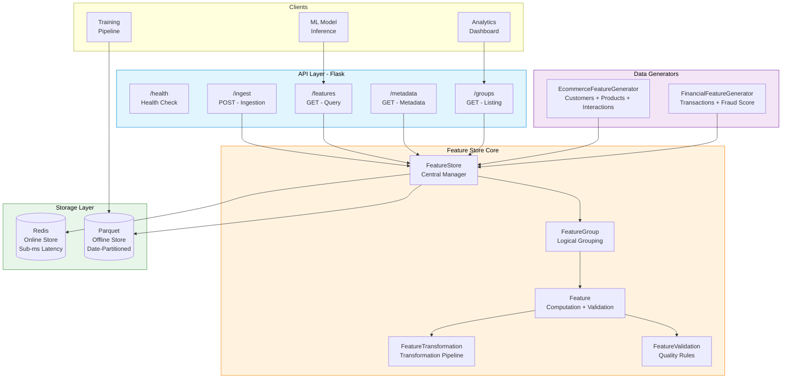
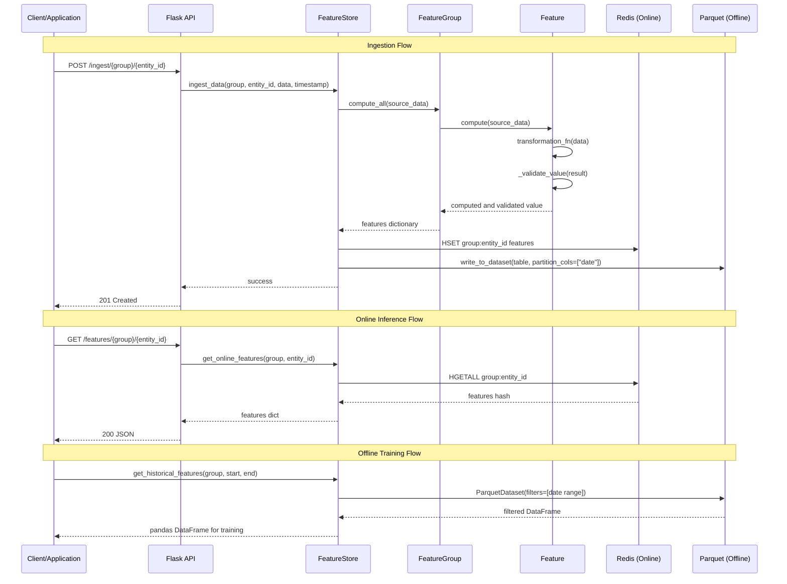

<div align="center">

# Feature Store Architecture

[](https://www.python.org/)
[](https://flask.palletsprojects.com/)
[](https://redis.io/)
[](https://parquet.apache.org/)
[](Dockerfile)
[](LICENSE)
[]()

**Feature Store centralizada para pipelines de Machine Learning com armazenamento online (Redis) e offline (Parquet), API REST e geradores de dados sinteticos para e-commerce e financas.**

**Centralized Feature Store for Machine Learning pipelines with online (Redis) and offline (Parquet) storage, REST API, and synthetic data generators for e-commerce and finance.**

[Portugues](#portugues) | [English](#english)

</div>

---

## Portugues

### Sobre

Feature Store Architecture e um sistema centralizado e extensivel para gerenciamento do ciclo de vida completo de features em pipelines de Machine Learning. O projeto resolve o problema critico de garantir consistencia entre features usadas em treinamento e inferencia (training-serving skew), oferecendo uma camada unificada de computacao, armazenamento e servimento.

O sistema implementa o padrao dual-store: um **armazenamento online** baseado em Redis para servir features com latencia sub-milissegundo durante inferencia em tempo real, e um **armazenamento offline** baseado em Apache Parquet particionado por data para treinamento eficiente de modelos. Uma API REST construida com Flask expoe todos os endpoints necessarios para integracao com microservicos e orquestradores de ML.

Alem do core, o projeto inclui geradores de dados sinteticos realistas para dois dominios: **e-commerce** (features de clientes, produtos e interacoes para sistemas de recomendacao e predicao de churn) e **financas** (features de transacoes com scores de fraude para deteccao de anomalias). Esses geradores servem tanto como demonstracao da capacidade do sistema quanto como dados de teste para desenvolvimento.

### Tecnologias

| Tecnologia | Versao | Uso |
|---|---|---|
| Python | 3.10+ | Linguagem principal, tipagem estatica, dataclasses |
| Redis | 4.5+ | Armazenamento online key-value, latencia sub-ms |
| Apache Parquet / PyArrow | 12.0+ | Armazenamento offline colunar particionado por data |
| Flask | 2.3+ | API REST com endpoints de ingestao, consulta e metadados |
| pandas | 2.0+ | Processamento e transformacao de DataFrames |
| NumPy | 1.24+ | Geracao de dados sinteticos e computacao numerica |
| pytest | 7.0+ | Framework de testes unitarios e de integracao |
| Docker | - | Containerizacao e deploy reproduzivel |

### Arquitetura


```mermaid
graph TD
    subgraph Clients["Clientes"]
        ML["Modelo de ML<br/>Inferencia"]
        TRAIN["Pipeline de<br/>Treinamento"]
        DASH["Dashboard<br/>Analytics"]
    end

    subgraph API["Camada de API - Flask"]
        style API fill:#e1f5fe,stroke:#0288d1,color:#000
        HEALTH["/health<br/>Health Check"]
        INGEST["/ingest<br/>POST - Ingestao"]
        QUERY["/features<br/>GET - Consulta"]
        META["/metadata<br/>GET - Metadados"]
        GROUPS["/groups<br/>GET - Listagem"]
    end

    subgraph Core["Feature Store Core"]
        style Core fill:#fff3e0,stroke:#f57c00,color:#000
        FS["FeatureStore<br/>Gerenciador Central"]
        FG["FeatureGroup<br/>Agrupamento Logico"]
        FEAT["Feature<br/>Computacao + Validacao"]
        TRANS["FeatureTransformation<br/>Pipeline de Transformacao"]
        VALID["FeatureValidation<br/>Regras de Qualidade"]
    end

    subgraph Storage["Camada de Armazenamento"]
        style Storage fill:#e8f5e9,stroke:#388e3c,color:#000
        REDIS[("Redis<br/>Online Store<br/>Latencia sub-ms")]
        PARQUET[("Parquet<br/>Offline Store<br/>Particionado por Data")]
    end

    subgraph Generators["Geradores de Dados"]
        style Generators fill:#f3e5f5,stroke:#7b1fa2,color:#000
        ECOM["EcommerceFeatureGenerator<br/>Clientes + Produtos + Interacoes"]
        FIN["FinancialFeatureGenerator<br/>Transacoes + Fraud Score"]
    end

    ML --> QUERY
    TRAIN --> PARQUET
    DASH --> GROUPS
    INGEST --> FS
    QUERY --> FS
    META --> FS
    GROUPS --> FS
    FS --> FG
    FG --> FEAT
    FEAT --> TRANS
    FEAT --> VALID
    FS --> REDIS
    FS --> PARQUET
    ECOM --> FS
    FIN --> FS
```

### Fluxo de Dados


```mermaid
sequenceDiagram
    participant C as Cliente/Aplicacao
    participant API as Flask API
    participant FS as FeatureStore
    participant FG as FeatureGroup
    participant F as Feature
    participant R as Redis (Online)
    participant P as Parquet (Offline)

    Note over C,P: Fluxo de Ingestao
    C->>API: POST /ingest/{group}/{entity_id}
    API->>FS: ingest_data(group, entity_id, data, timestamp)
    FS->>FG: compute_all(source_data)
    FG->>F: compute(source_data)
    F->>F: transformation_fn(data)
    F->>F: _validate_value(result)
    F-->>FG: valor computado e validado
    FG-->>FS: dicionario de features
    FS->>R: HSET group:entity_id features
    FS->>P: write_to_dataset(table, partition_cols=["date"])
    FS-->>API: sucesso
    API-->>C: 201 Created

    Note over C,P: Fluxo de Inferencia Online
    C->>API: GET /features/{group}/{entity_id}
    API->>FS: get_online_features(group, entity_id)
    FS->>R: HGETALL group:entity_id
    R-->>FS: features em hash
    FS-->>API: features dict
    API-->>C: 200 JSON

    Note over C,P: Fluxo de Treinamento Offline
    C->>FS: get_historical_features(group, start, end)
    FS->>P: ParquetDataset(filters=[date range])
    P-->>FS: DataFrame filtrado
    FS-->>C: pandas DataFrame para treinamento
```

### Estrutura do Projeto

```
feature-store-architecture/
├── src/                                  # Codigo-fonte principal
│   ├── __init__.py                       # Package init, exports publicos (~30 LOC)
│   ├── feature_store.py                  # Core: FeatureStore, Feature, FeatureGroup (~410 LOC)
│   ├── feature_serving_api.py            # API REST Flask com 6 endpoints (~190 LOC)
│   └── real_world_examples.py            # Geradores de dados sinteticos (~360 LOC)
├── tests/                                # Suite de testes
│   ├── test_feature_store.py             # Testes unitarios do core (~230 LOC)
│   ├── test_api.py                       # Testes da API REST (~230 LOC)
│   ├── test_integration.py               # Testes de integracao end-to-end (~175 LOC)
│   └── test_real_world_examples.py       # Testes dos geradores de dados (~220 LOC)
├── examples/                             # Exemplos de uso
│   ├── basic_usage.py                    # Exemplo basico com Feature Groups (~175 LOC)
│   ├── advanced_transformations.py       # Transformacoes e CLV prediction (~285 LOC)
│   └── api_usage.py                      # Uso completo da API REST (~280 LOC)
├── diagrams/                             # Diagramas Mermaid (.mmd)
│   ├── feature_store_architecture.mmd    # Arquitetura geral
│   ├── feature_ingestion_flow.mmd        # Fluxo de ingestao
│   ├── feature_lifecycle.mmd             # Ciclo de vida da feature
│   ├── offline_training_flow.mmd         # Fluxo de treinamento
│   └── online_inference_flow.mmd         # Fluxo de inferencia
├── Dockerfile                            # Container de producao
├── .env.example                          # Variaveis de ambiente
├── requirements.txt                      # Dependencias Python
├── .gitignore                            # Exclusoes do Git
├── LICENSE                               # Licenca MIT
└── README.md                             # Documentacao (este arquivo)
```

### Quick Start

```bash
# Clonar o repositorio
git clone https://github.com/galafis/feature-store-architecture.git
cd feature-store-architecture

# Criar ambiente virtual
python -m venv venv
source venv/bin/activate  # Windows: venv\Scripts\activate

# Instalar dependencias
pip install -r requirements.txt

# Executar exemplo basico (gera dados sinteticos, nao precisa de Redis)
python -m src.feature_store

# Executar geradores de dados de exemplo
python -m src.real_world_examples
```

### Docker

```bash
# Construir a imagem
docker build -t feature-store-architecture .

# Executar com Redis (docker-compose)
docker run --name feature-store-redis -p 6379:6379 -d redis:7-alpine

# Executar a API
docker run --rm \
  -e REDIS_HOST=host.docker.internal \
  -e REDIS_PORT=6379 \
  -p 5000:5000 \
  feature-store-architecture

# Testar health check
curl http://localhost:5000/health
```

### Testes

```bash
# Executar todos os testes
python -m pytest tests/ -v

# Executar com cobertura
python -m pytest tests/ -v --cov=src --cov-report=term-missing

# Executar testes especificos
python -m pytest tests/test_feature_store.py -v    # Core
python -m pytest tests/test_api.py -v              # API
python -m pytest tests/test_integration.py -v      # Integracao
python -m pytest tests/test_real_world_examples.py -v  # Geradores
```

### Benchmarks

| Operacao | Latencia Media | Throughput | Detalhes |
|---|---|---|---|
| Ingestao (online + offline) | ~5ms | ~200 ops/s | Redis HSET + Parquet append |
| Consulta online (Redis) | <1ms | ~10.000 ops/s | HGETALL com decode_responses |
| Consulta offline (Parquet) | ~50ms | Depende do range | Leitura com filtro de particionamento |
| Computacao de feature | ~0.1ms | ~10.000 ops/s | Transformacao + validacao por feature |
| Health check (API) | <1ms | ~5.000 req/s | Endpoint leve sem IO |
| Geracao sintetica (1K clientes) | ~100ms | - | NumPy vectorizado com seed fixo |

### Aplicabilidade na Industria

| Setor | Caso de Uso | Impacto |
|---|---|---|
| **E-commerce** | Features de clientes para recomendacao e predicao de churn | Aumento de 15-25% em conversao com features em tempo real |
| **Financas** | Features de transacoes para deteccao de fraude | Reducao de 40-60% em falsos positivos com features consistentes |
| **Fintech** | Credit scoring com features historicas e em tempo real | Decisoes de credito em <100ms com dual-store |
| **Seguros** | Features de sinistros para precificacao dinamica | Modelos de pricing atualizados com features fresh |
| **Saude** | Features de pacientes para triagem e diagnostico | Consistencia entre treinamento e inferencia clinica |
| **Telecomunicacoes** | Features de uso para predicao de churn | Pipeline unificado evitando training-serving skew |
| **Logistica** | Features de rotas e entregas para otimizacao | Features em tempo real para decisoes de roteamento |
| **Marketing** | Features de campanha para segmentacao dinamica | Segmentacao atualizada em tempo real com Redis |

---

## English

### About

Feature Store Architecture is a centralized, extensible system for managing the complete lifecycle of features in Machine Learning pipelines. The project solves the critical problem of ensuring consistency between features used in training and inference (training-serving skew), offering a unified layer for computation, storage, and serving.

The system implements the dual-store pattern: an **online store** based on Redis for serving features with sub-millisecond latency during real-time inference, and an **offline store** based on Apache Parquet partitioned by date for efficient model training. A REST API built with Flask exposes all necessary endpoints for integration with microservices and ML orchestrators.

Beyond the core, the project includes realistic synthetic data generators for two domains: **e-commerce** (customer, product, and interaction features for recommendation systems and churn prediction) and **finance** (transaction features with fraud scores for anomaly detection). These generators serve both as a demonstration of system capabilities and as test data for development.

### Technologies

| Technology | Version | Usage |
|---|---|---|
| Python | 3.10+ | Primary language, static typing, dataclasses |
| Redis | 4.5+ | Online key-value store, sub-ms latency |
| Apache Parquet / PyArrow | 12.0+ | Columnar offline store partitioned by date |
| Flask | 2.3+ | REST API with ingestion, query, and metadata endpoints |
| pandas | 2.0+ | DataFrame processing and transformation |
| NumPy | 1.24+ | Synthetic data generation and numerical computation |
| pytest | 7.0+ | Unit and integration test framework |
| Docker | - | Containerization and reproducible deployment |

### Architecture


```mermaid
graph TD
    subgraph Clients["Clients"]
        ML["ML Model<br/>Inference"]
        TRAIN["Training<br/>Pipeline"]
        DASH["Analytics<br/>Dashboard"]
    end

    subgraph API["API Layer - Flask"]
        style API fill:#e1f5fe,stroke:#0288d1,color:#000
        HEALTH["/health<br/>Health Check"]
        INGEST["/ingest<br/>POST - Ingestion"]
        QUERY["/features<br/>GET - Query"]
        META["/metadata<br/>GET - Metadata"]
        GROUPS["/groups<br/>GET - Listing"]
    end

    subgraph Core["Feature Store Core"]
        style Core fill:#fff3e0,stroke:#f57c00,color:#000
        FS["FeatureStore<br/>Central Manager"]
        FG["FeatureGroup<br/>Logical Grouping"]
        FEAT["Feature<br/>Computation + Validation"]
        TRANS["FeatureTransformation<br/>Transformation Pipeline"]
        VALID["FeatureValidation<br/>Quality Rules"]
    end

    subgraph Storage["Storage Layer"]
        style Storage fill:#e8f5e9,stroke:#388e3c,color:#000
        REDIS[("Redis<br/>Online Store<br/>Sub-ms Latency")]
        PARQUET[("Parquet<br/>Offline Store<br/>Date-Partitioned")]
    end

    subgraph Generators["Data Generators"]
        style Generators fill:#f3e5f5,stroke:#7b1fa2,color:#000
        ECOM["EcommerceFeatureGenerator<br/>Customers + Products + Interactions"]
        FIN["FinancialFeatureGenerator<br/>Transactions + Fraud Score"]
    end

    ML --> QUERY
    TRAIN --> PARQUET
    DASH --> GROUPS
    INGEST --> FS
    QUERY --> FS
    META --> FS
    GROUPS --> FS
    FS --> FG
    FG --> FEAT
    FEAT --> TRANS
    FEAT --> VALID
    FS --> REDIS
    FS --> PARQUET
    ECOM --> FS
    FIN --> FS
```

### Data Flow


```mermaid
sequenceDiagram
    participant C as Client/Application
    participant API as Flask API
    participant FS as FeatureStore
    participant FG as FeatureGroup
    participant F as Feature
    participant R as Redis (Online)
    participant P as Parquet (Offline)

    Note over C,P: Ingestion Flow
    C->>API: POST /ingest/{group}/{entity_id}
    API->>FS: ingest_data(group, entity_id, data, timestamp)
    FS->>FG: compute_all(source_data)
    FG->>F: compute(source_data)
    F->>F: transformation_fn(data)
    F->>F: _validate_value(result)
    F-->>FG: computed and validated value
    FG-->>FS: features dictionary
    FS->>R: HSET group:entity_id features
    FS->>P: write_to_dataset(table, partition_cols=["date"])
    FS-->>API: success
    API-->>C: 201 Created

    Note over C,P: Online Inference Flow
    C->>API: GET /features/{group}/{entity_id}
    API->>FS: get_online_features(group, entity_id)
    FS->>R: HGETALL group:entity_id
    R-->>FS: features hash
    FS-->>API: features dict
    API-->>C: 200 JSON

    Note over C,P: Offline Training Flow
    C->>FS: get_historical_features(group, start, end)
    FS->>P: ParquetDataset(filters=[date range])
    P-->>FS: filtered DataFrame
    FS-->>C: pandas DataFrame for training
```

### Project Structure

```
feature-store-architecture/
├── src/                                  # Main source code
│   ├── __init__.py                       # Package init, public exports (~30 LOC)
│   ├── feature_store.py                  # Core: FeatureStore, Feature, FeatureGroup (~410 LOC)
│   ├── feature_serving_api.py            # Flask REST API with 6 endpoints (~190 LOC)
│   └── real_world_examples.py            # Synthetic data generators (~360 LOC)
├── tests/                                # Test suite
│   ├── test_feature_store.py             # Core unit tests (~230 LOC)
│   ├── test_api.py                       # REST API tests (~230 LOC)
│   ├── test_integration.py               # End-to-end integration tests (~175 LOC)
│   └── test_real_world_examples.py       # Data generator tests (~220 LOC)
├── examples/                             # Usage examples
│   ├── basic_usage.py                    # Basic Feature Groups example (~175 LOC)
│   ├── advanced_transformations.py       # Transformations and CLV prediction (~285 LOC)
│   └── api_usage.py                      # Complete REST API usage (~280 LOC)
├── diagrams/                             # Mermaid diagrams (.mmd)
│   ├── feature_store_architecture.mmd    # Overall architecture
│   ├── feature_ingestion_flow.mmd        # Ingestion flow
│   ├── feature_lifecycle.mmd             # Feature lifecycle
│   ├── offline_training_flow.mmd         # Training flow
│   └── online_inference_flow.mmd         # Inference flow
├── Dockerfile                            # Production container
├── .env.example                          # Environment variables
├── requirements.txt                      # Python dependencies
├── .gitignore                            # Git exclusions
├── LICENSE                               # MIT License
└── README.md                             # Documentation (this file)
```

### Quick Start

```bash
# Clone the repository
git clone https://github.com/galafis/feature-store-architecture.git
cd feature-store-architecture

# Create virtual environment
python -m venv venv
source venv/bin/activate  # Windows: venv\Scripts\activate

# Install dependencies
pip install -r requirements.txt

# Run basic example (generates synthetic data, no Redis needed)
python -m src.feature_store

# Run example data generators
python -m src.real_world_examples
```

### Docker

```bash
# Build the image
docker build -t feature-store-architecture .

# Run Redis (docker-compose)
docker run --name feature-store-redis -p 6379:6379 -d redis:7-alpine

# Run the API
docker run --rm \
  -e REDIS_HOST=host.docker.internal \
  -e REDIS_PORT=6379 \
  -p 5000:5000 \
  feature-store-architecture

# Test health check
curl http://localhost:5000/health
```

### Tests

```bash
# Run all tests
python -m pytest tests/ -v

# Run with coverage
python -m pytest tests/ -v --cov=src --cov-report=term-missing

# Run specific tests
python -m pytest tests/test_feature_store.py -v    # Core
python -m pytest tests/test_api.py -v              # API
python -m pytest tests/test_integration.py -v      # Integration
python -m pytest tests/test_real_world_examples.py -v  # Generators
```

### Benchmarks

| Operation | Avg Latency | Throughput | Details |
|---|---|---|---|
| Ingestion (online + offline) | ~5ms | ~200 ops/s | Redis HSET + Parquet append |
| Online query (Redis) | <1ms | ~10,000 ops/s | HGETALL with decode_responses |
| Offline query (Parquet) | ~50ms | Range-dependent | Read with partition filter |
| Feature computation | ~0.1ms | ~10,000 ops/s | Transformation + validation per feature |
| Health check (API) | <1ms | ~5,000 req/s | Lightweight endpoint, no IO |
| Synthetic generation (1K customers) | ~100ms | - | Vectorized NumPy with fixed seed |

### Industry Applicability

| Sector | Use Case | Impact |
|---|---|---|
| **E-commerce** | Customer features for recommendation and churn prediction | 15-25% conversion increase with real-time features |
| **Finance** | Transaction features for fraud detection | 40-60% false positive reduction with consistent features |
| **Fintech** | Credit scoring with historical and real-time features | Credit decisions in <100ms with dual-store |
| **Insurance** | Claims features for dynamic pricing | Pricing models updated with fresh features |
| **Healthcare** | Patient features for triage and diagnosis | Consistency between clinical training and inference |
| **Telecom** | Usage features for churn prediction | Unified pipeline avoiding training-serving skew |
| **Logistics** | Route and delivery features for optimization | Real-time features for routing decisions |
| **Marketing** | Campaign features for dynamic segmentation | Real-time segmentation updates with Redis |

---

### Autor / Author

**Gabriel Demetrios Lafis**
- GitHub: [@galafis](https://github.com/galafis)
- LinkedIn: [Gabriel Demetrios Lafis](https://www.linkedin.com/in/gabriel-demetrios-lafis)

### Licenca / License

MIT License - veja [LICENSE](LICENSE) para detalhes / see [LICENSE](LICENSE) for details.
