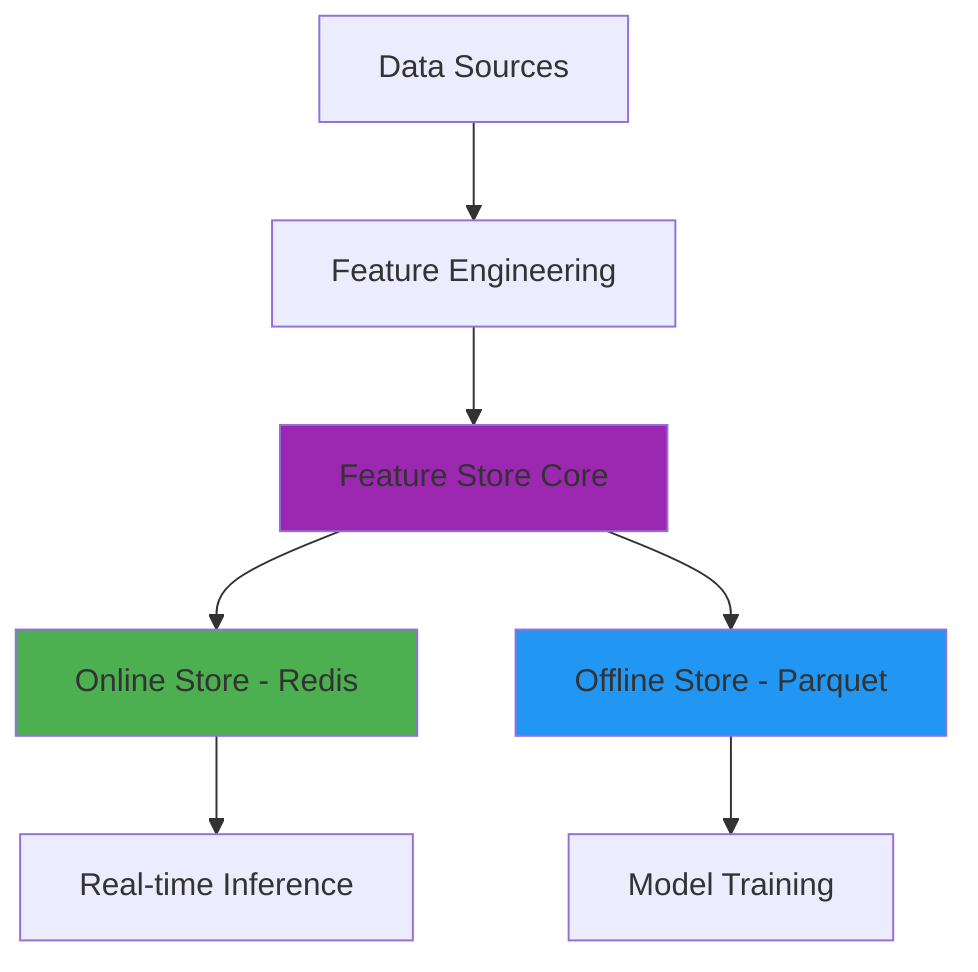

# Feature Store Architecture


---

## 🇧🇷 Arquitetura de Feature Store

Este repositório explora e demonstra **arquiteturas e implementações de Feature Stores**, componentes cruciais para a operacionalização de modelos de Machine Learning (ML). O foco é em como projetar, construir e gerenciar um Feature Store que suporte o ciclo de vida completo do ML, desde o desenvolvimento até a implantação e monitoramento, garantindo **consistência, reusabilidade e baixa latência** para features em ambientes de treinamento e inferência.

### 🎯 Objetivo

O principal objetivo deste projeto é **fornecer um guia prático e exemplos de código** para engenheiros de ML, cientistas de dados e arquitetos que desejam implementar ou otimizar um Feature Store. Serão abordados os conceitos fundamentais, padrões de design, tecnologias comuns e as melhores práticas para garantir um fluxo de trabalho de ML eficiente e robusto, com ênfase na integração de armazenamento online e offline e uma API de serviço de features.

### ✨ Destaques

- **Armazenamento Online e Offline**: Implementação de um Feature Store com suporte a armazenamento online (utilizando **Redis** para baixa latência) e offline (utilizando arquivos **Parquet** para armazenamento histórico e treinamento em lote), garantindo consistência entre os ambientes.
- **Exemplos com Dados Reais**: Módulo `real_world_examples.py` que gera features realistas para cenários de **e-commerce** (recomendação, churn prediction) e **finanças** (detecção de fraude, credit scoring), com datasets completos em formato Parquet.
- **Transformações e Validações Avançadas**: Demonstração de como definir e aplicar transformações complexas e regras de validação para features, assegurando a qualidade e a relevância dos dados para os modelos de ML.
- **API de Serviço de Features (Flask)**: Uma API RESTful construída com **Flask** para servir features em tempo real, permitindo que modelos em produção consultem features com baixa latência para inferência online.
- **Consistência de Features**: Estratégias para garantir que as features usadas no treinamento sejam idênticas às usadas na inferência, eliminando o *skew* de treinamento/serviço.
- **Reusabilidade e Descoberta**: Como organizar e catalogar features para que possam ser facilmente descobertas e reutilizadas por diferentes equipes e modelos.
- **Código Profissional**: Exemplos de código bem estruturados, seguindo as melhores práticas da indústria, com foco em modularidade, escalabilidade e manutenibilidade.
- **Documentação Completa**: Cada aspecto da arquitetura é acompanhado de documentação detalhada, diagramas explicativos e casos de uso práticos.
- **Testes Incluídos**: Módulos de código validados através de testes unitários e de integração, garantindo a robustez e a confiabilidade das soluções.
- **Abordagem Didática**: Conteúdo apresentado de forma didática, ideal para aprendizado e referência, com explicações claras sobre os conceitos e a aplicação prática.

### 🏛️ Componentes de uma Feature Store em Ação

Uma arquitetura de Feature Store é composta por vários componentes que trabalham em conjunto para fornecer um fluxo de trabalho de ML eficiente e robusto. Este projeto ilustra a implementação dos seguintes componentes:

1.  **Repositório de Features (Feature Repository):** As definições de features, metadados (`FeatureMetadata`, `FeatureGroup`) e transformações (`FeatureTransformation`) são gerenciadas centralmente, permitindo versionamento e descoberta.

2.  **Pipeline de Ingestão (Ingestion Pipeline):** O método `ingest_features` simula a ingestão de dados brutos e a computação de features, que são então armazenadas nos armazenamentos online e offline.

3.  **Computação de Features (Feature Computation):** As transformações são aplicadas para converter dados brutos em features prontas para uso, tanto para treinamento em lote quanto para inferência em tempo real.

4.  **Armazenamento Online (Online Store):** Implementado com **Redis**, este componente armazena as features mais recentes para acesso de baixa latência por modelos em produção.

5.  **Armazenamento Offline (Offline Store):** Utiliza arquivos **Parquet** para armazenar o histórico completo das features, ideal para treinamento de modelos, análise exploratória e *backfilling*.

6.  **API de Serviço de Features:** Uma API RESTful (Flask) que permite que aplicações e modelos consultem features do armazenamento online em tempo real, desacoplando o serviço de features da lógica do modelo.

7.  **Catálogo de Features (Feature Catalog):** Embora não seja uma UI completa, a capacidade de `list_features` e `get_feature_metadata` serve como base para um catálogo, permitindo a descoberta e o entendimento das features disponíveis.

---

## 🇬🇧 Feature Store Architecture

This repository explores and demonstrates **Feature Store architectures and implementations**, crucial components for operationalizing Machine Learning (ML) models. The focus is on how to design, build, and manage a Feature Store that supports the entire ML lifecycle, from development to deployment and monitoring, ensuring **consistency, reusability, and low latency** for features in training and inference environments.

### 🎯 Objective

The main objective of this project is to **provide a practical guide and code examples** for ML engineers, data scientists, and architects who want to implement or optimize a Feature Store. It will cover fundamental concepts, design patterns, common technologies, and best practices to ensure an efficient and robust ML workflow, with an emphasis on integrating online and offline storage and a feature serving API.

### ✨ Highlights

- **Online and Offline Storage**: Implementation of a Feature Store with support for online storage (using **Redis** for low latency) and offline storage (using **Parquet** files for historical data and batch training), ensuring consistency across environments.
- **Advanced Transformations and Validations**: Demonstration of how to define and apply complex transformations and validation rules for features, ensuring the quality and relevance of data for ML models.
- **Feature Serving API (Flask)**: A RESTful API built with **Flask** to serve features in real-time, allowing production models to query features with low latency for online inference.
- **Feature Consistency**: Strategies to ensure that features used in training are identical to those used in inference, eliminating training/serving skew.
- **Reusability and Discoverability**: How to organize and catalog features so they can be easily discovered and reused by different teams and models.
- **Professional Code**: Well-structured code examples, following industry best practices, with a focus on modularity, scalability, and maintainability.
- **Complete Documentation**: Every aspect of the architecture is accompanied by detailed documentation, explanatory diagrams, and practical use cases.
- **Tests Included**: Code modules validated through unit and integration tests, ensuring the robustness and reliability of the solutions.
- **Didactic Approach**: Content presented didactically, ideal for learning and reference, with clear explanations of concepts and practical application.

### 🏛️ Feature Store Components in Action

A Feature Store architecture comprises several components that work together to provide an efficient and robust ML workflow. This project illustrates the implementation of the following components:

1.  **Feature Repository:** Feature definitions, metadata (`FeatureMetadata`, `FeatureGroup`), and transformations (`FeatureTransformation`) are centrally managed, allowing for versioning and discoverability.

2.  **Ingestion Pipeline:** The `ingest_features` method simulates the ingestion of raw data and feature computation, which are then stored in both online and offline stores.

3.  **Feature Computation:** Transformations are applied to convert raw data into ready-to-use features, for both batch training and real-time inference.

4.  **Online Store:** Implemented with **Redis**, this component stores the latest features for low-latency access by production models.

5.  **Offline Store:** Uses **Parquet** files to store the complete history of features, ideal for model training, exploratory analysis, and backfilling.

6.  **Feature Serving API:** A RESTful API (Flask) that allows applications and models to query features from the online store in real-time, decoupling feature serving from model logic.

7.  **Feature Catalog:** While not a full UI, the ability to `list_features` and `get_feature_metadata` serves as a foundation for a catalog, enabling the discovery and understanding of available features.

### 📊 Visualization


*Diagrama ilustrativo da arquitetura de um Feature Store, destacando os principais componentes e o fluxo de dados.*


---

## 🛠️ Tecnologias Utilizadas / Technologies Used

| Categoria         | Tecnologia      | Descrição                                                                 |
| :---------------- | :-------------- | :------------------------------------------------------------------------ |
| **Linguagem**     | Python          | Linguagem principal para desenvolvimento da Feature Store e API.          |
| **Framework Web** | Flask           | Utilizado para construir a API RESTful de serviço de features.            |
| **Armazenamento Online** | Redis           | Banco de dados em memória para armazenamento de features de baixa latência. |
| **Armazenamento Offline** | Apache Parquet  | Formato de arquivo colunar para armazenamento eficiente de features históricas. |
| **Serialização**  | JSON            | Para metadados e comunicação da API.                                      |
| **Testes**        | `unittest`      | Framework de testes padrão do Python para validação de funcionalidades.   |
| **Diagramação**   | Mermaid         | Para criação de diagramas de arquitetura e fluxo de dados no README.      |

---

## 📁 Repository Structure

```
feature-store-architecture/
├── src/
│   ├── __init__.py
│   ├── feature_store.py         # Lógica principal da Feature Store
│   └── feature_serving_api.py   # Implementação da API Flask
├── data/                        # Dados de exemplo e arquivos Parquet para o offline store
├── images/                      # Imagens e diagramas para o README e documentação
├── tests/                       # Testes unitários e de integração
├── docs/                        # Documentação adicional e guias detalhados
├── config/                      # Arquivos de configuração (ex: para Redis)
├── requirements.txt             # Dependências Python
└── README.md                    # Este arquivo
```

---

## 🚀 Getting Started

### 📖 Documentação Completa

Este repositório inclui documentação detalhada para todos os aspectos da Feature Store:

- **[Getting Started Guide](docs/GETTING_STARTED.md)** - Guia passo a passo para iniciantes
- **[Architecture Documentation](docs/ARCHITECTURE.md)** - Detalhes da arquitetura e design patterns
- **[Best Practices](docs/BEST_PRACTICES.md)** - Melhores práticas para produção
- **[API Reference](src/)** - Documentação das classes e métodos

### Pré-requisitos

- Python 3.9+
- Docker (opcional, para rodar Redis facilmente)
- Servidor Redis em execução (pode ser local ou via Docker)

### Instalação Rápida

```bash
# Clone o repositório
git clone https://github.com/galafis/feature-store-architecture.git
cd feature-store-architecture

# Crie um ambiente virtual (recomendado)
python -m venv venv
source venv/bin/activate  # Linux/macOS
# ou: venv\Scripts\activate  # Windows

# Instale as dependências
pip install -r requirements.txt

# Inicie o Redis com Docker
docker run --name feature-store-redis -p 6379:6379 -d redis/redis-stack-server:latest

# Ou instale Redis localmente
# Ubuntu/Debian: sudo apt-get install redis-server
# macOS: brew install redis
```

### ⚡ Quick Start

```python
from src.feature_store import FeatureStore, FeatureGroup, FeatureMetadata, FeatureType, FeatureStatus

# Inicializar Feature Store
fs = FeatureStore(name="my-feature-store")

# Criar e registrar features
customer_fg = FeatureGroup(
    name="customer_features",
    entity="customer",
    description="Features de clientes",
    features=[
        FeatureMetadata(
            name="total_purchases",
            description="Total de compras",
            feature_type=FeatureType.NUMERICAL,
            entity="customer",
            owner="analytics@example.com",
            status=FeatureStatus.ACTIVE
        )
    ]
)
fs.register_feature_group(customer_fg)

# Ingerir features
fs.ingest_features("customer_features", "CUST001", {"total_purchases": 10})

# Buscar features online
features = fs.get_online_features("customer_features", "CUST001")
print(features)
```

Para exemplos mais detalhados, veja o [Getting Started Guide](docs/GETTING_STARTED.md).

### Exemplo de Uso Avançado (Python)

O exemplo abaixo demonstra a inicialização da `FeatureStore` com armazenamento online (Redis) e offline (Parquet), ingestão de features, e a interação com a API de serviço de features. Este código ilustra como os componentes da Feature Store trabalham juntos para gerenciar e servir features de ML.

```python
from src.feature_store import FeatureStore, FeatureMetadata, FeatureType, FeatureStatus, FeatureGroup, FeatureTransformation, FeatureValidation
from datetime import datetime
import requests
import json
import time

# Exemplo de uso da Feature Store
if __name__ == "__main__":
    print("\n==================================================")
    print("Demonstração da Arquitetura de Feature Store")
    print("==================================================")

    # --- 1. Inicializar Feature Store ---
    print("\n--- 1. Inicializando Feature Store ---")
    fs = FeatureStore(name="production-feature-store", redis_host="localhost", redis_port=6379)
    
    # --- 2. Criar e Registrar um Feature Group ---
    print("\n--- 2. Criando e Registrando Feature Group 'customer_features' ---")
    customer_fg = FeatureGroup(
        name="customer_features",
        entity="customer",
        description="Features relacionadas a clientes",
        features=[
            FeatureMetadata(
                name="total_purchases",
                description="Número total de compras do cliente",
                feature_type=FeatureType.NUMERICAL,
                entity="customer",
                owner="data-team@company.com",
                tags=["customer", "purchases"],
                status=FeatureStatus.ACTIVE
            ),
            FeatureMetadata(
                name="avg_purchase_value",
                description="Valor médio das compras do cliente",
                feature_type=FeatureType.NUMERICAL,
                entity="customer",
                owner="data-team@company.com",
                tags=["customer", "purchases", "value"],
                status=FeatureStatus.ACTIVE,
                transformation=FeatureTransformation(
                    name="calculate_avg_purchase",
                    description="Calcula a média de valor das compras",
                    source_features=["total_purchases", "total_spent"],
                    transformation_fn=lambda data: data["total_spent"] / data["total_purchases"] if data["total_purchases"] > 0 else 0
                )
            ),
            FeatureMetadata(
                name="customer_segment",
                description="Segmento do cliente baseado em comportamento",
                feature_type=FeatureType.CATEGORICAL,
                entity="customer",
                owner="data-team@company.com",
                tags=["customer", "segment"],
                status=FeatureStatus.ACTIVE,
                validation=FeatureValidation(
                    allowed_values=["bronze", "silver", "gold", "platinum"]
                )
            )
        ]
    )
    fs.register_feature_group(customer_fg)
    print("  Feature Group 'customer_features' registrado com sucesso.")

    # --- 3. Ingestão de Features ---
    print("\n--- 3. Ingestão de Features para o Online e Offline Store ---")
    customer_data_to_ingest = [
        {
            "entity_id": "CUST001",
            "total_purchases": 15,
            "total_spent": 1500.00,
            "customer_segment": "gold",
            "timestamp": datetime.now().isoformat()
        },
        {
            "entity_id": "CUST002",
            "total_purchases": 5,
            "total_spent": 250.00,
            "customer_segment": "silver",
            "timestamp": datetime.now().isoformat()
        },
        {
            "entity_id": "CUST003",
            "total_purchases": 20,
            "total_spent": 3000.00,
            "customer_segment": "platinum",
            "timestamp": datetime.now().isoformat()
        }
    ]
    for data in customer_data_to_ingest:
        fs.ingest_features("customer_features", data["entity_id"], data)
    print("  Features ingeridas com sucesso.")

    # --- 4. Servindo Features Online via API (simulado) ---
    print("\n--- 4. Servindo Features Online via API (simulado) ---")
    # Em um cenário real, a API Flask estaria rodando em um processo separado.
    # Aqui, simulamos a chamada HTTP.
    print("  Assumindo que a API Flask está rodando em http://127.0.0.1:5000")
    api_base_url = "http://127.0.0.1:5000"

    # Exemplo de consulta para CUST001
    try:
        response = requests.get(f"{api_base_url}/features/customer/CUST001?features=total_purchases,avg_purchase_value,customer_segment")
        response.raise_for_status() # Levanta HTTPError para códigos de status de erro
        features_cust001 = response.json()
        print(f"  Features para CUST001: {features_cust001}")
    except requests.exceptions.ConnectionError:
        print("  AVISO: Não foi possível conectar à API Flask. Certifique-se de que ela está rodando (python src/feature_serving_api.py).")
    except Exception as e:
        print(f"  Erro ao consultar API para CUST001: {e}")

    # Exemplo de consulta para CUST002
    try:
        response = requests.get(f"{api_base_url}/features/customer/CUST002?features=total_purchases,customer_segment")
        response.raise_for_status()
        features_cust002 = response.json()
        print(f"  Features para CUST002: {features_cust002}")
    except requests.exceptions.ConnectionError:
        pass # Já avisamos acima
    except Exception as e:
        print(f"  Erro ao consultar API para CUST002: {e}")

    # --- 5. Buscando Features Offline (para treinamento) ---
    print("\n--- 5. Buscando Features Offline (para treinamento) ---")
    # Isso geraria um arquivo Parquet no diretório 'data/offline_store'
    print("  Gerando features offline para 'customer_features'...")
    offline_df = fs.get_offline_features("customer_features")
    if offline_df is not None:
        print(f"  Features offline geradas. Exemplo (primeiras 2 linhas):\n{offline_df.head(2)}")
    else:
        print("  Nenhuma feature offline gerada ou encontrada.")

    # --- 6. Listar Features Registradas ---
    print("\n--- 6. Listando Features Registradas ---")
    all_registered_features = fs.list_features()
    for f_meta in all_registered_features:
        print(f"  - {f_meta.name} ({f_meta.entity}) - Type: {f_meta.feature_type}, Status: {f_meta.status}")

    # --- 7. Depreciar uma Feature ---
    print("\n--- 7. Depreciando a Feature 'customer_segment' ---")
    fs.deprecate_feature("customer_segment", "customer")
    print("  Feature 'customer_segment' depreciada. Verificando status:")
    updated_meta = fs.get_feature_metadata("customer_segment", "customer")
    if updated_meta:
        print(f"  Status de 'customer_segment': {updated_meta.status}")

    print("\n==================================================")
    print("Demonstração Concluída.")
    print("==================================================")
```

---

## 🌐 API REST

A Feature Store inclui uma API REST completa para servir features em produção.

### Iniciar o Servidor

```bash
python src/feature_serving_api.py
```

Ou usando código:

```python
from src.feature_serving_api import create_app

app = create_app()
app.run(host='0.0.0.0', port=5000)
```

### Endpoints Disponíveis

#### Health Check
```bash
curl http://localhost:5000/health
```

#### Buscar Features Online
```bash
curl http://localhost:5000/features/customer_features/CUST001
# Com filtro de features específicas:
curl "http://localhost:5000/features/customer_features/CUST001?features=total_purchases,avg_order_value"
```

#### Ingerir Features
```bash
curl -X POST http://localhost:5000/ingest/customer_features/CUST001 \
  -H "Content-Type: application/json" \
  -d '{"total_purchases": 15, "avg_order_value": 120.50}'
```

#### Listar Feature Groups
```bash
curl http://localhost:5000/groups
```

#### Listar Todas as Features
```bash
curl http://localhost:5000/features
```

#### Buscar Metadados de Feature
```bash
curl http://localhost:5000/features/customer/total_purchases/metadata
```

---

## 🎓 Exemplos do Mundo Real

O repositório inclui geradores de dados realistas para cenários comuns de ML:

### E-commerce

```python
from src.real_world_examples import EcommerceFeatureGenerator

gen = EcommerceFeatureGenerator()

# Gerar features de clientes
customers = gen.generate_customer_features(num_customers=1000)

# Gerar features de produtos
products = gen.generate_product_features(num_products=500)

# Gerar interações cliente-produto
interactions = gen.generate_interaction_features(customers, products, num_interactions=5000)
```

**Features Incluídas:**
- Métricas comportamentais (total de compras, valor médio, engajamento)
- Features demográficas (idade, gênero)
- Features de risco (probabilidade de churn)
- Features temporais (tempo desde última compra, tenure)

### Finanças

```python
from src.real_world_examples import FinancialFeatureGenerator

gen = FinancialFeatureGenerator()

# Gerar features de transações financeiras
transactions = gen.generate_transaction_features(num_transactions=2000)
```

**Features Incluídas:**
- Valores e tipos de transação
- Features de localização geográfica
- Features temporais (hora do dia)
- Scores de fraude calculados

### Executar Todos os Exemplos

```bash
python src/real_world_examples.py
```

Isso gerará datasets completos em `data/examples/`:
- `ecommerce_customers.parquet`
- `ecommerce_products.parquet`
- `ecommerce_interactions.parquet`
- `financial_transactions.parquet`

---

## 🧪 Testes

O projeto inclui uma suíte completa de testes unitários e de integração.

### Executar Todos os Testes

```bash
pytest tests/ -v
```

### Executar com Cobertura

```bash
pytest tests/ -v --cov=src --cov-report=html
# Abrir htmlcov/index.html no navegador para ver o relatório
```

### Executar Testes Específicos

```bash
# Apenas testes unitários
pytest tests/test_feature_store.py -v

# Apenas testes de integração
pytest tests/test_integration.py -v

# Teste específico
pytest tests/test_feature_store.py::TestFeatureStore::test_ingest_data_online_store -v
```

### CI/CD

Os testes são executados automaticamente via GitHub Actions em cada push e pull request. Veja o badge no topo do README para o status atual.

---

## 📊 Diagramas e Visualizações

### Arquitetura da Feature Store


*Diagrama completo mostrando todos os componentes e fluxos de dados*

O diagrama em formato Mermaid está disponível em [`diagrams/feature_store_architecture.mmd`](diagrams/feature_store_architecture.mmd) e pode ser visualizado no GitHub ou editado com ferramentas compatíveis com Mermaid.

### Componentes Principais



---

## 🚀 Roadmap

### Funcionalidades Planejadas

- [ ] **Feature Monitoring Dashboard**: UI para monitorar saúde e uso de features
- [ ] **Feature Lineage Tracking**: Rastreamento completo de dependências
- [ ] **Automatic Feature Discovery**: Descoberta automática de features úteis
- [ ] **Feature Store CLI**: Interface de linha de comando completa
- [ ] **Multi-cloud Support**: Suporte para AWS, GCP, Azure
- [ ] **Stream Processing**: Integração com Kafka/Kinesis
- [ ] **Feature Encryption**: Criptografia de features sensíveis
- [ ] **A/B Testing Support**: Framework para testar features
- [ ] **Feature Marketplace**: Compartilhamento de features entre times
- [ ] **AutoML Integration**: Integração com frameworks de AutoML

### Versões Futuras

**v2.0.0**
- Feature versioning avançado
- Feature store federado (múltiplas instâncias)
- Suporte para features de streaming

**v3.0.0**
- Feature store como serviço (FaaS)
- Machine Learning feature lifecycle management
- Advanced governance e compliance

---

## 🤝 Contribuição

Contribuições são bem-vindas! Sinta-se à vontade para abrir issues, enviar pull requests ou sugerir melhorias. Por favor, siga as diretrizes de contribuição.

---

## 📝 Licença

Este projeto está licenciado sob a Licença MIT - veja o arquivo [LICENSE](LICENSE) para detalhes.

---

**Autor:** Gabriel Demetrios Lafis  \n**Ano:** 2025