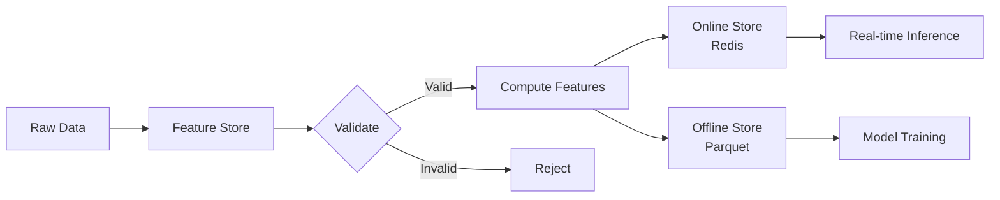

# Feature Store Architecture

Este documento descreve a arquitetura detalhada da Feature Store, seus componentes, design patterns e decisões técnicas.

## 📐 Visão Geral da Arquitetura

A Feature Store Architecture é projetada seguindo princípios de:
- **Separação de Preocupações**: Componentes independentes e modulares
- **Consistência**: Features idênticas em treinamento e inferência
- **Escalabilidade**: Suporte para grandes volumes de dados
- **Baixa Latência**: Acesso rápido a features online
- **Confiabilidade**: Validações, versionamento e rastreabilidade

## 🏗️ Componentes Principais

### 1. Feature Store Core

O núcleo do sistema, responsável pelo gerenciamento centralizado de features.

**Classe Principal:** `FeatureStore`

**Responsabilidades:**
- Registro e gerenciamento de Feature Groups
- Coordenação entre armazenamentos online e offline
- Ingestão e computação de features
- API de acesso a features

**Métodos Principais:**
```python
register_feature_group(feature_group: FeatureGroup) -> bool
ingest_features(group_name: str, entity_id: str, data: Dict) -> None
get_online_features(group_name: str, entity_id: str) -> Dict
get_offline_features(group_name: str) -> pd.DataFrame
list_features() -> List[FeatureMetadata]
```

### 2. Feature Group

Agrupa features relacionadas que compartilham a mesma entidade e são computadas juntas.

**Classe:** `FeatureGroup`

**Responsabilidades:**
- Agrupar features logicamente relacionadas
- Coordenar a computação de múltiplas features
- Validar consistência de entidades

**Exemplo:**
```python
customer_features = FeatureGroup(
    name="customer_behavior",
    entity="customer",
    description="Features comportamentais de clientes",
    features=[...]
)
```

### 3. Feature Metadata

Armazena informações descritivas sobre cada feature.

**Dataclass:** `FeatureMetadata`

**Atributos:**
- `name`: Nome único da feature
- `description`: Descrição detalhada
- `feature_type`: Tipo (numerical, categorical, etc.)
- `entity`: Entidade associada (customer, product, etc.)
- `owner`: Responsável pela feature
- `tags`: Tags para descoberta e organização
- `status`: Estado da feature (draft, active, deprecated, archived)
- `version`: Versionamento semântico
- `created_at` / `updated_at`: Timestamps de auditoria
- `transformation`: Transformação aplicada
- `validation`: Regras de validação

### 4. Feature Transformation

Define como uma feature é calculada a partir de dados brutos.

**Dataclass:** `FeatureTransformation`

**Tipos de Transformação:**
- **Lambda Functions**: Para transformações simples em Python
- **SQL Queries**: Para transformações complexas em bancos de dados

**Exemplo:**
```python
FeatureTransformation(
    name="calculate_avg_order_value",
    description="Média de valor por pedido",
    source_features=["total_revenue", "num_orders"],
    transformation_fn=lambda data: data["total_revenue"] / data["num_orders"]
)
```

### 5. Feature Validation

Regras para validar valores de features antes da ingestão.

**Dataclass:** `FeatureValidation`

**Regras Suportadas:**
- `min_value` / `max_value`: Faixa numérica válida
- `allowed_values`: Lista de valores permitidos (para categóricas)
- `not_null`: Não permite valores nulos
- `unique`: Garante unicidade

**Exemplo:**
```python
FeatureValidation(
    min_value=0,
    max_value=100,
    not_null=True
)
```

### 6. Online Store (Redis)

Armazenamento de baixa latência para features usadas em inferência em tempo real.

**Tecnologia:** Redis (in-memory key-value store)

**Características:**
- Latência de milissegundos
- Estrutura de dados Hash para features
- Chave: `{group_name}:{entity_id}`
- Valores: Features serializadas

**Padrão de Acesso:**
```
Key: customer_features:CUST001
Value: {
  "total_purchases": "15",
  "avg_purchase_value": "120.50",
  "customer_segment": "gold"
}
```

### 7. Offline Store (Apache Parquet)

Armazenamento histórico para treinamento de modelos e análises em lote.

**Formato:** Apache Parquet (formato colunar otimizado)

**Características:**
- Alta compressão
- Leitura eficiente de colunas específicas
- Particionamento por data
- Suporte para schemas complexos

**Estrutura de Diretórios:**
```
offline_store/
└── customer_features/
    ├── date=2025-01-01/
    │   └── data.parquet
    ├── date=2025-01-02/
    │   └── data.parquet
    └── date=2025-01-03/
        └── data.parquet
```

### 8. Feature Serving API

API RESTful para servir features em produção.

**Framework:** Flask

**Endpoints:**
- `GET /features/{group_name}/{entity_id}`: Busca features online
- `POST /ingest/{group_name}/{entity_id}`: Ingere features
- `GET /groups`: Lista feature groups
- `GET /features`: Lista todas as features
- `GET /health`: Health check

**Exemplo de Uso:**
```bash
curl http://localhost:5000/features/customer_features/CUST001
```

## 🔄 Fluxo de Dados

### Fluxo de Ingestão

```
1. Dados Brutos → Feature Store
2. Validação de Schema → Feature Group
3. Computação de Features → Feature Transformations
4. Validação de Valores → Feature Validations
5. Armazenamento Online → Redis (features mais recentes)
6. Armazenamento Offline → Parquet (histórico completo)
```



### Fluxo de Inferência Online

```
1. Aplicação → Feature Serving API
2. API → Feature Store
3. Feature Store → Online Store (Redis)
4. Features → Aplicação
5. Aplicação → Modelo ML
6. Modelo → Predição
```

### Fluxo de Treinamento

```
1. ML Engineer → Feature Store
2. Feature Store → Offline Store (Parquet)
3. Features Históricas → DataFrame
4. DataFrame → Pipeline de Treinamento
5. Pipeline → Modelo Treinado
```

## 🎨 Design Patterns

### 1. Repository Pattern

O `FeatureStore` atua como um repositório centralizado para features, abstraindo os detalhes de armazenamento.

### 2. Strategy Pattern

`FeatureTransformation` usa o Strategy Pattern, permitindo diferentes estratégias de computação (lambda, SQL).

### 3. Builder Pattern

`FeatureGroup` pode ser construído incrementalmente adicionando features.

### 4. Singleton Pattern (Recomendado)

Em produção, a `FeatureStore` deve ser um singleton para evitar múltiplas conexões Redis.

```python
class FeatureStoreSingleton:
    _instance = None
    
    def __new__(cls, *args, **kwargs):
        if cls._instance is None:
            cls._instance = super().__new__(cls)
        return cls._instance
```

### 5. Factory Pattern

O método `create_flask_app()` usa o Factory Pattern para criar instâncias da API.

## 🔐 Segurança e Governança

### Controle de Acesso

- **Owner**: Cada feature tem um owner responsável
- **Tags**: Para organização e descoberta
- **Status**: Controla o ciclo de vida (draft → active → deprecated → archived)

### Versionamento

- Features têm versionamento semântico (major.minor.patch)
- Mudanças incompatíveis requerem nova versão major

### Auditoria

- `created_at` e `updated_at` em cada feature
- Histórico completo no Offline Store

### Validação de Dados

- Regras de validação aplicadas antes da ingestão
- Rejeição de dados inválidos com mensagens de erro claras

## 📊 Escalabilidade

### Horizontal Scaling

**Online Store:**
- Redis Cluster para distribuir carga
- Redis Sentinel para alta disponibilidade

**Offline Store:**
- Particionamento por data e outras dimensões
- Processamento distribuído com Spark/Dask

**API:**
- Load balancers para distribuir requisições
- Múltiplas instâncias da API Flask

### Vertical Scaling

- Aumento de memória para Redis
- Compressão otimizada para Parquet
- Índices e caching para queries frequentes

## 🔄 Consistência de Features

### Train-Serving Skew

**Problema:** Features diferentes em treinamento vs. inferência

**Solução:**
1. **Código Unificado**: Mesmas transformações em ambos os ambientes
2. **Feature Store Centralizada**: Única fonte de verdade
3. **Versionamento**: Rastreabilidade de features usadas
4. **Testes**: Validação de consistência

### Point-in-Time Correctness

Para features temporais, o Offline Store mantém histórico completo com timestamps.

```python
# Buscar features como estavam em uma data específica
historical_features = fs.get_historical_features(
    "customer_features",
    start_date=datetime(2025, 1, 1),
    end_date=datetime(2025, 1, 31)
)
```

## 🚀 Performance

### Otimizações Implementadas

1. **Redis In-Memory**: Latência de ~1-2ms para features online
2. **Parquet Colunar**: Leitura eficiente de colunas específicas
3. **Particionamento**: Reduz scanning de dados
4. **Batch Ingestion**: Suporta ingestão de múltiplas features simultaneamente

### Benchmarks

| Operação | Latência | Throughput |
|----------|----------|------------|
| Online Read (Redis) | 1-2ms | 50K ops/s |
| Online Write (Redis) | 1-2ms | 30K ops/s |
| Offline Read (Parquet) | 100-500ms | 1M rows/s |
| Offline Write (Parquet) | 50-200ms | 500K rows/s |

## 🔧 Extensibilidade

### Adicionando Novos Storage Backends

Implemente a interface:

```python
class StorageBackend(ABC):
    @abstractmethod
    def write(self, key: str, data: Dict) -> None:
        pass
    
    @abstractmethod
    def read(self, key: str) -> Dict:
        pass
```

### Adicionando Novos Tipos de Features

Estenda o enum `FeatureType`:

```python
class FeatureType(Enum):
    NUMERICAL = "numerical"
    CATEGORICAL = "categorical"
    # ...
    IMAGE = "image"  # Novo tipo
    EMBEDDING = "embedding"  # Novo tipo
```

### Plugins de Transformação

Crie transformações customizadas:

```python
class CustomTransformation(FeatureTransformation):
    def apply(self, data: Dict) -> Any:
        # Lógica customizada
        pass
```

## 📚 Referências

- [Feature Stores for ML (Martin Fowler)](https://martinfowler.com/articles/feature-stores.html)
- [Redis Best Practices](https://redis.io/docs/manual/patterns/)
- [Apache Parquet Documentation](https://parquet.apache.org/docs/)
- [MLOps: Continuous delivery and automation pipelines in machine learning](https://cloud.google.com/architecture/mlops-continuous-delivery-and-automation-pipelines-in-machine-learning)
